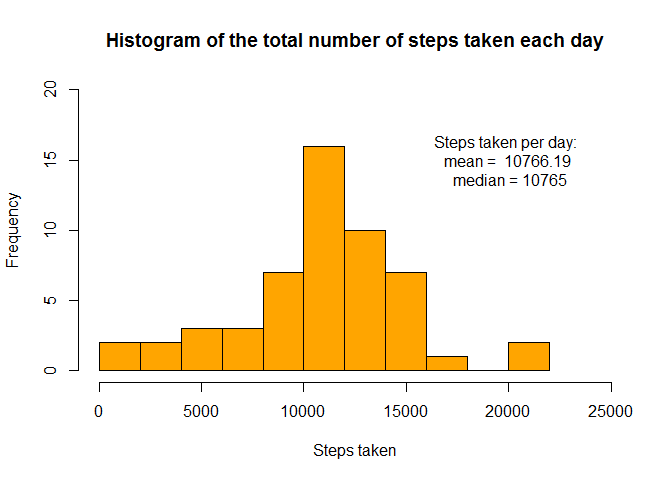
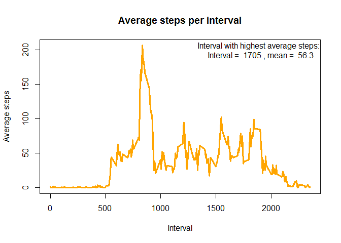
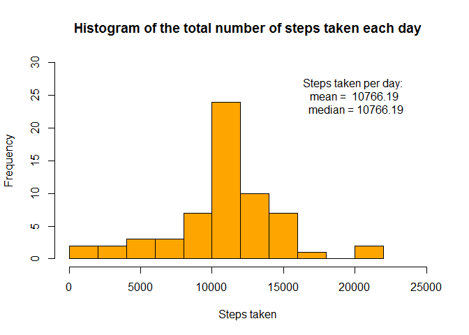
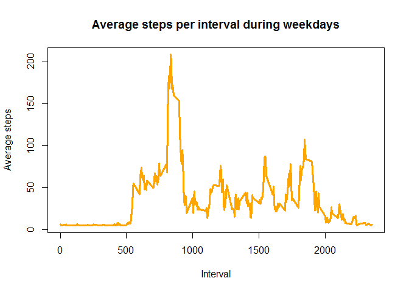
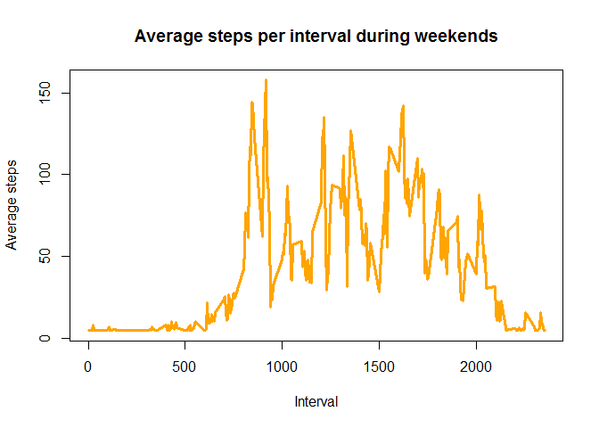

# Reproducible Research: Peer Assessment 1


## Loading and preprocessing the data


```r
wd <- getwd()
download.file(url="https://d396qusza40orc.cloudfront.net/repdata%2Fdata%2Factivity.zip",destfile = wd, method = "curl")
```

```
## Warning: running command 'curl
## "https://d396qusza40orc.cloudfront.net/repdata%2Fdata%2Factivity.zip" -o
## "C:/Users/KiHr/Documents/GitHub/repdata_peerassessment1"' had status 127
```

```
## Warning in download.file(url =
## "https://d396qusza40orc.cloudfront.net/repdata%2Fdata%2Factivity.zip", :
## download had nonzero exit status
```

```r
list.files <-unzip("activity.zip",list=TRUE)
unzip <- unz("activity.zip", list.files$Name[1])
activity_raw <- read.csv(unz("activity.zip", list.files$Name[1]))
activity_raw$date <- as.Date(activity_raw$date)
```

## What is mean total number of steps taken per day?


```r
#prepare data for histogram
stepsPerDay <- aggregate(activity_raw$steps, by = list(activity_raw$date), sum)
meanStepsPerDay <- mean(stepsPerDay$x, na.rm = T)
medianStepsPerDay <- median(stepsPerDay$x, na.rm = T)

#plot histogram
hist(x = stepsPerDay$x, xlab = "Steps taken", main = "Histogram of the total number of steps taken each day", ylim = c(0,20), xlim=c(0,25000),breaks = 10, col="orange")

#Add mean and median steps per day in plot
text(x  = 20000, y = 15,labels= paste("Steps taken per day:", "\n", "mean = ", round(meanStepsPerDay, digits=2), "\n", "median =", medianStepsPerDay))
```

 

## What is the average daily activity pattern?


```r
#Preparation for plot
activity_naRmSteps <- activity_raw[! is.na(activity_raw$steps),]
averageStepsPerInterval <- aggregate(activity_naRmSteps$steps, by = list(activity_naRmSteps$interval), mean)

#Time series plot
plot(averageStepsPerInterval$Group.1, averageStepsPerInterval$x, type = "l", lwd = 3, xlab = "Interval", ylab = "Average steps", main = "Average steps per interval", col = "orange", )

#Add interval with highest average steps
maxStepsInterval <- averageStepsPerInterval[max(averageStepsPerInterval$x),]
text(x  = 1900, y = 200,labels= paste("Interval with highest average steps:", "\n", "Interval = ", maxStepsInterval$Group.1, ", mean = ", round(maxStepsInterval$x, digits=2)))
```

 

## Imputing missing values


```r
#Which columns contain missings?
naSteps <- activity_raw$steps[is.na(activity_raw$steps)]
naDate <- activity_raw$date[is.na(activity_raw$date)]
naInterval <- activity_raw$interval[is.na(activity_raw$interval)]

lengthColumns <- c(length(naSteps), length(naDate), length(naInterval))
names(lengthColumns) <-c("Steps", "Date", "Interval")
outputColumns <- names(lengthColumns[lengthColumns > 0])

#Replacing strategy
meanSteps <- mean(activity_raw$steps, na.rm = T)

#New dataset
activity_missingsReplaced <- activity_raw
activity_missingsReplaced$steps[is.na(activity_raw$steps)] <- mean(activity_raw$steps, na.rm = T)

#Preparation and plotting of new histogram
stepsPerDayNaRM <- aggregate(activity_missingsReplaced$steps, by = list(activity_missingsReplaced$date), sum)
meanStepsPerDay <- mean(stepsPerDayNaRM$x, na.rm = T)
medianStepsPerDay <- round(median(stepsPerDayNaRM$x, na.rm = T), digits=2)

hist(x = stepsPerDayNaRM$x, xlab = "Steps taken", main = "Histogram of the total number of steps taken each day", ylim = c(0,30), xlim=c(0,25000),breaks = 10, col="orange")

#Add mean and median steps per day in plot
text(x  = 20000, y = 25,labels= paste("Steps taken per day:", "\n", "mean = ", round(meanStepsPerDay, digits=2), "\n", "median =", medianStepsPerDay))
```

 

###Missing value strategy

Column(s) that contain missing values are/is: <br> 
Steps

The missing values of this column(s) was replaced with the average: <br>
37.3825996

## Are there differences in activity patterns between weekdays and weekends?


```r
#Create weekWeekend variable
activity_missingsReplaced$weekday <- weekdays(activity_missingsReplaced$date)
activity_missingsReplaced$weekWeekend <- "Weekday"
activity_missingsReplaced$weekWeekend[which(activity_missingsReplaced$weekday=="Saturday" | activity_missingsReplaced$weekday=="Sunday")] <- "Weekend"

#Preparation for plot
averageStepsIntervalWeekWeekend <- aggregate(activity_missingsReplaced$steps, by = list(activity_missingsReplaced$interval, activity_missingsReplaced$weekWeekend ), mean)

averageStepsIntervalWeek <- averageStepsIntervalWeekWeekend[averageStepsIntervalWeekWeekend$Group.2=="Weekday",]
averageStepsIntervalWeekend <- averageStepsIntervalWeekWeekend[averageStepsIntervalWeekWeekend$Group.2=="Weekend",]


#Time series plot
plot(averageStepsIntervalWeek$Group.1, averageStepsIntervalWeek$x, type = "l", lwd = 3, xlab = "Interval", ylab = "Average steps", main = "Average steps per interval during weekdays", col = "orange")

plot(averageStepsIntervalWeekend$Group.1, averageStepsIntervalWeekend$x, type = "l", lwd = 3, xlab = "Interval", ylab = "Average steps", main = "Average steps per interval during weekends", col = "orange")
```


